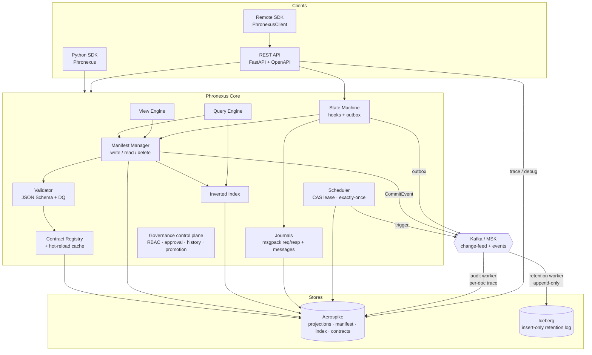
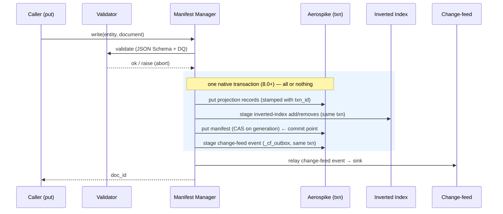
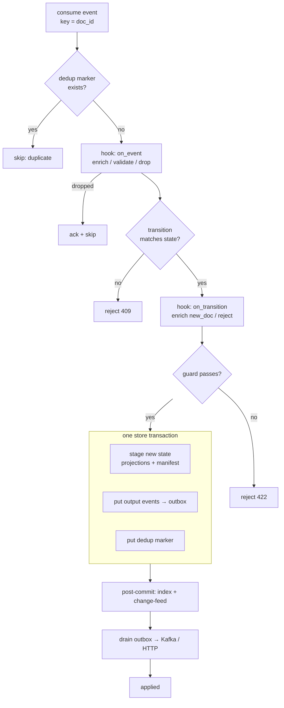

# Architecture

Phronexus Core is a **contract-driven data projection framework**. One logical
document is projected into many physical records — each shaped for a read path —
and made visible atomically via a **manifest**. Everything about an entity
(shape, searchability, output, lifecycle, quality) is described by **versioned
contracts** that live in the store and hot-reload, so new business entities are
onboarded by config, not code.

## Components



Two **change-feed consumers** run decoupled from the hot write path, each in its
own process (scale/restart freely): the **retention worker** (→ Iceberg) and the
**audit worker** (→ a per-document trace, powering the console's *Trace* tab and
`GET …/trace`). With no Kafka (the in-memory dev backend) the audit consumer runs
inline off the in-process feed, so a trace exists with zero services.

Above the data plane sits the **governance control plane** ([governance.md](governance.md)):
config-driven RBAC, a change→approve→publish workflow (N-of-M approvals + separation of
duties), an immutable hash-chained history, environment promotion, a per-environment COB
(processing date), backfill control, and tamper-evident evidence export. It wraps — never
bypasses — the contract registry's `publish`/`activate` primitives. Storage entities can
opt into **bitemporal** mode ([bitemporal.md](bitemporal.md)) for as-of-reproducible reads
against a COB.

The **seven contract kinds** drive every layer:

| Contract | Drives | Layer |
|---|---|---|
| `storage` | primary key, projections across sets, update/delete policy, TTL, **bitemporal** temporal mode, Iceberg | Manifest Manager |
| `query` | searchable fields + indexes, named query patterns | Inverted Index + Query Engine |
| `view` | consumer output: allow-list, masking, transforms | View Engine |
| `validation` | JSON Schema + data-quality checks | Validator |
| `transition` | state-machine states, guards, emitted events (payload shaped from fields) | State Machine |
| `stream` | JSON Schema on **outbound** messages (produce-time validation) | State Machine output |
| `ingress` | JSON Schema on **inbound** messages (validated before a transition) | State Machine input |

## The write path (manifest pattern)

Aerospike has strong single-record ops but no free cross-record atomicity. The
manifest is the single commit point: **all projections are written first, then
the manifest last**. Reads go through the manifest, so a half-written document is
invisible.



- **Optimistic concurrency**: the manifest is written with a generation CAS.
- **Snapshot reads**: reads resolve the manifest → committed projections whose
  `txn_id` matches.
- **Crash safety**: partial writes leave invisible orphans, swept by the reaper.
- **Index atomicity**: inverted-index mutations are staged into the *same*
  transaction as the manifest (`index.in_txn`, default on), so a committed
  document can never be missing from search. A stale posting (from a since-aged
  read) is still validated away on read; the document is always addressable by
  primary key. Set `index.in_txn: false` to update the index post-commit
  (cheaper on hot terms, but a crash between commit and reindex misses entries
  until a backfill).

## The transactional state machine

Phronexus can run as an event-driven state machine. State + output events +
dedup marker commit in **one** transaction (transactional outbox); a relay then
publishes to Kafka. Guarantee: **atomic durable transition + effectively-once
emission**.



Three faces share the same `StateMachine.process()`:

| Face | Entry | Semantics |
|---|---|---|
| Autonomous service | `python -m phronexus.statemachine.runner` | Kafka in → transition → Kafka out (async) |
| Synchronous REST | `POST /entities/{entity}/events` | accept/reject in the HTTP response |
| Embedded DAG node | `PhronexusStateMachineNode.calculate()` | a DishtaYantra `CalculationNode` |

## Distributed scheduler

Schedules fire **exactly once across replicas**. Each occurrence is claimed with
a generation-CAS lease on a per-schedule state record; the winner writes the
claim and a trigger outbox row in one transaction and relays it to a topic,
losers get a conflict and skip. State lives in Aerospike, so any number of
replicas can run for availability without generating duplicate events. Runs
standalone (`python -m phronexus.scheduler.runner`), over REST (`/schedules`), or
embedded (`px.scheduler()`).

## Insert-only retention + binary journals

The retention worker appends every `CommitEvent` to Iceberg as an **immutable
row** (`_txn` idempotency key, `_version` order, `_op` incl. delete tombstones,
`_raw` msgpack blob). Current state is a **derived view** (`reconcile()` — latest
`_version` per doc, tombstones dropped), so replays are idempotent and the
consumer only needs at-least-once delivery with **manual offset commit**.

Because the `_raw` blob is a lossless copy, `ResyncJob` can rebuild a date window
in **either direction** — rehydrate the hot store from Iceberg (a silent,
coords-preserving restore) or re-land hot documents into it
([resync.md](resync.md)).

The same **msgpack envelope** convention (metadata bins + one blob) backs the
journals: a **message journal** (full inbound Kafka message) and a
**request/response journal** (the state machine records every `process()` when
enabled) — an audit trail that round-trips byte-faithfully.

## Native access

Beyond the small `KVStore` API, `px.native_aerospike()` exposes native Aerospike
features (expressions, CDT ops, `operate()`, batch, secondary-index queries,
UDFs) and **guards Phronexus-managed sets** so direct writes can't bypass the
manifest. Native client policies pass through via `aerospike.policies` /
`aerospike.client_config`.

## Package layout

```
phronexus/
  config.py            central Settings (env / .env / per-subsystem YAML)
  kv/                  KVStore abstraction: memory + aerospike backends, txns
  contracts/           models, loader, versioned registry + hot-reload cache
  storage/             projection engine (document -> projection records)
  manifest/            write/read/delete via the manifest pattern; reaper
  query/               inverted index + JSON/YAML query engine
  views/               consumer view projection
  validation/          JSON Schema + data-quality validator
  statemachine/        transactional state machine (hooks, I/O, node, runner)
  scheduler/           distributed exactly-once scheduler (CAS lease, runner)
  retention/           insert-only Iceberg log: source, warehouse, worker
  audit/               per-document trace: change-feed consumer (log, worker, main)
  events/              change-feed sinks (memory, kafka)
  codec.py             msgpack pack/unpack (binary envelopes)
  journal.py           message + request/response journals
  native.py            supported native-Aerospike accessor (managed-set guard)
  kafka_client.py      Kafka/MSK client builder (TLS/mTLS/SASL/IAM)
  admin/               ops jobs: contract backfill + hot↔cold store resync
  observability/       structured logging + OTel telemetry
  api/                 FastAPI app, routers, auth, middleware, server
  sdk/                 PhronexusClient (remote HTTP SDK)
  cli.py               phronexus admin CLI
  core.py              Phronexus facade
```
