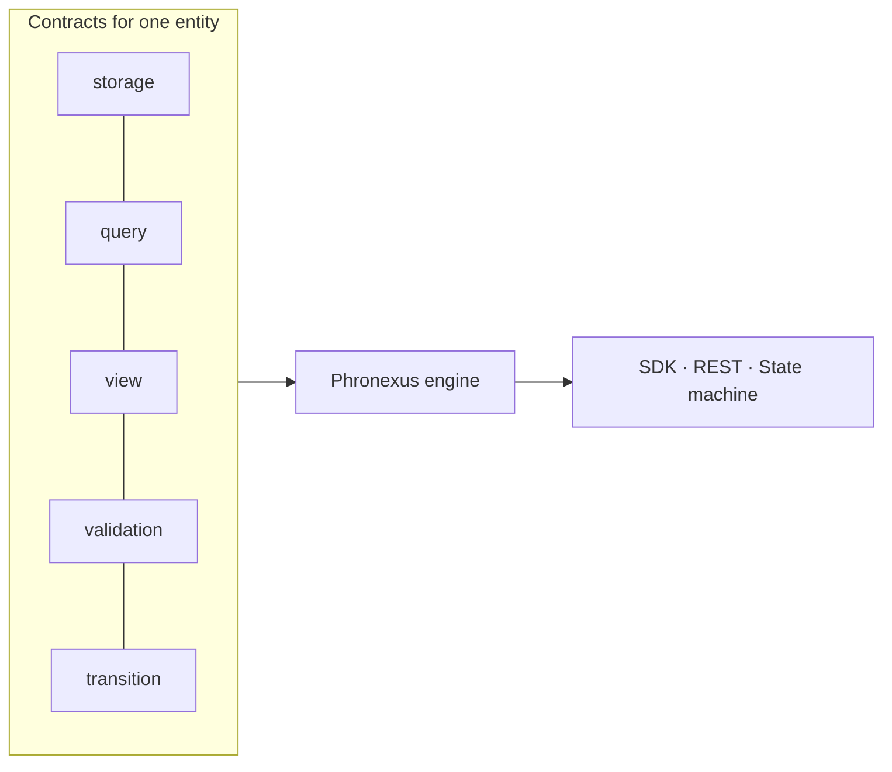
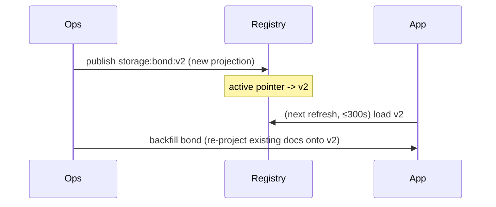

# Building on Phronexus

A practical guide to building a product on Phronexus Core. You'll onboard a new
business entity **entirely through config**, then read, query, validate, view,
and drive its lifecycle — with no entity-specific Python.

- New here? Read [architecture.md](architecture.md) first for the mental model.
- Contract field reference: [contracts-reference.md](contracts-reference.md).
- Going to production: [deployment.md](deployment.md).

## Install & run

```bash
python -m venv .venv && . .venv/bin/activate
pip install -e '.[dev]'
pytest                                   # full suite, no services needed
python examples/bond/run_bond.py         # the worked example below
```

The default backend is in-memory, so everything in this guide runs with **no
Aerospike/Kafka/Iceberg**. Point at real infrastructure via config when you're
ready ([deployment.md](deployment.md)).

## The mental model

You describe an entity with up to **five contracts**; Phronexus does the rest.



Only `storage` is required. Add the others as you need search, output shaping,
quality gates, or lifecycle.

---

## Tutorial: onboard a `bond` entity by config

All files are in [`examples/bond/`](../examples/bond); the runnable script is
[`run_bond.py`](../examples/bond/run_bond.py).

### 1. Storage — how it's persisted

One logical document, two projections (a canonical full copy keyed by primary
key, and a read-optimised copy keyed by issuer):

```yaml
# examples/bond/bond.storage.yaml
kind: storage
entity: bond
version: 1
primary_key: [isin]
manifest_set: bond_manifest
update_policy: upsert          # or insert_only
delete_policy: soft            # or hard
projections:
  - {name: main,      set: bond_main,      key: "{isin}",          fields: ["*"], canonical: true}
  - {name: by_issuer, set: bond_by_issuer, key: "{issuer}:{isin}", fields: [isin, issuer, coupon, currency, maturity_date, status]}
iceberg: {enabled: true, table: warehouse.bonds, partition_by: [maturity_date], retention_days: 3650}
```

Rules the loader enforces: exactly one `canonical` projection with `fields: ["*"]`,
and its key references only primary-key fields (so a document is always
addressable by id).

### 2. Query — what's searchable

```yaml
# examples/bond/bond.query.yaml
kind: query
entity: bond
version: 1
searchable:
  - {field: issuer,        index: string}
  - {field: coupon,        index: numeric}   # numeric enables range queries
  - {field: maturity_date, index: numeric}
patterns:
  - {name: by_issuer,        where: [{field: issuer, op: eq, value: "${issuer}"}]}
  - {name: issuer_min_coupon, where: [
        {field: issuer, op: eq,  value: "${issuer}"},
        {field: coupon, op: gte, value: "${min_coupon}"}]}
```

### 3. Validation — JSON Schema + data quality

```yaml
# examples/bond/bond.validation.yaml
kind: validation
entity: bond
version: 1
mode: enforce                  # enforce | warn_only | off
json_schema:                   # structural / syntax validation (Draft 2020-12)
  type: object
  required: [isin, issuer, coupon, currency, maturity_date]
  properties:
    isin: {type: string, minLength: 12, maxLength: 12}
    coupon: {type: number}
    maturity_date: {type: integer}
dq_checks:                     # semantic quality rules
  - {name: coupon_range, expr: "coupon >= 0 and coupon <= 30", severity: error}
  - {name: ccy_supported, field: currency, in: [USD, EUR, GBP], severity: error}
  - {name: isin_format, field: isin, regex: "^[A-Z]{2}[A-Z0-9]{9}[0-9]$", severity: error}
```

Beyond field/expression rules, DQ supports **context-aware checks** that do a
store lookup — `unique` (no duplicate value across the entity) and `references`
(the value must point at an existing document of another entity):

```yaml
dq_checks:
  - {name: ext_id_unique, field: ext_id, unique: true}
  - {name: issuer_exists, field: issuer_id, references: issuer}
```

Both are evaluated at the write boundary; see
[contracts-reference.md](contracts-reference.md) for the concurrency note.

### 4. View — consumer output

```yaml
# examples/bond/bond.view.desk.yaml
kind: view
entity: bond
view: desk
version: 1
fields: [isin, issuer, coupon, currency, maturity_date, status]
transform: {coupon: round2}
# mask: [issuer]     # redact fields per consumer
```

### 5. Transition — lifecycle as a state machine

```yaml
# examples/bond/bond.transition.yaml
kind: transition
entity: bond
version: 1
state_field: status
transitions:
  - {event: BondIssued,  from: null,   to: active,  emit: [{topic: "kafka://bonds.active"}]}
  - {event: BondCalled,  from: active, to: called,  guard: "callable == True",
     emit: [{topic: "kafka://bonds.called"}]}
  - {event: BondMatured, from: active, to: matured, emit: [{topic: "kafka://bonds.matured"}]}
```

### 6. Use it — no bond-specific code

```python
from phronexus import Phronexus, Settings
from phronexus.statemachine import InputEvent

px = Phronexus(Settings(backend="memory"))
px.load_contract_dir("examples/bond")            # onboard the entity

apple = {"isin": "US0378331005", "issuer": "APPLE", "coupon": 3.85,
         "currency": "USD", "maturity_date": 20310215, "callable": True}

px.validate("bond", apple).ok                    # True  (schema + DQ)
px.put("bond", apple)                            # manifest write
px.get("bond", "US0378331005")                   # read by primary key
px.query_pattern("bond", "by_issuer", issuer="APPLE")
px.view("bond", "desk", "US0378331005")          # projected + transformed

sm = px.state_machine()
sm.process(InputEvent(entity="bond", event_type="BondIssued",
                      key="US0378331005", payload=apple, event_id="e1"))
# -> applied, status: active, emitted kafka://bonds.active
```

That's the whole onboarding. To add another entity (repo, swap, loan), drop in
its contracts — no code, no redeploy.

---

## Extending with code: processing hooks

When you need custom logic between consuming an event and committing (enrichment
from a reference-data service, bespoke validation, audit), register a
`ProcessingHook`. Hooks run for **all three** state-machine faces.

```python
from phronexus.statemachine import ProcessingHook, TransitionRejected

class EnrichAndScreen(ProcessingHook):
    def on_event(self, event):
        if event.payload.get("issuer") in BLOCKLIST:
            return None                          # DROP: ack + skip (not retried)
        return event

    def on_transition(self, ctx):                # runs BEFORE the commit
        ctx.new_doc["risk_weight"] = ctx.new_doc["coupon"] * 100
        if ctx.new_doc["coupon"] > 25:
            raise TransitionRejected("coupon above policy cap")

    def on_committed(self, event, result):       # post-commit side effects
        audit_log(event.event_id, result.to_state)

sm = px.state_machine(hooks=[EnrichAndScreen()])
```

**Rule:** any I/O belongs in `on_event` / `on_transition` (before the
transaction) so the store transaction stays tight; `on_committed` is post-commit
only. See [state-machine.md](state-machine.md) for the full contract.

## Flexible input/output topologies

Emit targets are URIs; a routing publisher dispatches by scheme, so one
transition can fan out to Kafka, an HTTP webhook, or nowhere:

```yaml
emit:
  - {topic: "kafka://bonds.active"}          # -> Kafka / MSK
  - {topic: "https://risk.svc/hooks/bond"}   # -> HTTP POST (TLS/mTLS)
  # emit: []  -> consumer-only, no output
```

Failed publishes stay in the outbox for retry (at-least-once).

**Schema on the wire (no external registry).** A `stream` contract registers a
JSON Schema per emitted event type; outbound events are validated against it at
produce time, so malformed events are never published:

```yaml
kind: stream
entity: bond
version: 1
events:
  - {type: BondActivated, json_schema: {type: object, required: [isin, status]}}
```

## Using the REST API & remote SDK

The same core is exposed over HTTP (OpenAPI at `/openapi.json`):

| Method & path | Purpose |
|---|---|
| `PUT /entities/{entity}/documents` | write |
| `GET /entities/{entity}/documents/{id}` | read |
| `POST /entities/{entity}/validate` | dry-run JSON Schema + DQ |
| `POST /entities/{entity}/query?view=` | query (optionally through a view) |
| `POST /entities/{entity}/events` | submit a lifecycle event (sync accept/reject) |
| `POST /contracts` | publish/activate a contract (admin) |

```python
from phronexus.sdk import PhronexusClient
c = PhronexusClient("https://phronexus.internal:8443", api_key="…")
c.put("bond", apple)
c.query("bond", [{"field": "issuer", "op": "eq", "value": "APPLE"}], view="desk")
```

## Evolving a contract (no redeploy)

Contracts are versioned; the active pointer is flipped when you publish. Running
apps pick up the change on their next cache refresh (default 300s).



```bash
phronexus --contracts-dir examples/bond backfill bond
```

Old documents remain readable under their original version until backfilled.

## Testing your extension

Everything runs on the in-memory backend, so tests need no services:

```python
def test_bond_lifecycle():
    px = Phronexus(Settings(backend="memory"))
    px.load_contract_dir("examples/bond")
    px.put("bond", apple)
    assert px.get("bond", apple["isin"])["issuer"] == "APPLE"
```

See the `tests/` directory for patterns covering writes, queries, views,
validation, the state machine, and the REST API.

## Where to next

- [contracts-reference.md](contracts-reference.md) — every contract field.
- [state-machine.md](state-machine.md) — the transactional state machine in depth.
- [deployment.md](deployment.md) — Aerospike / MSK / S3 Tables, security, ops.
