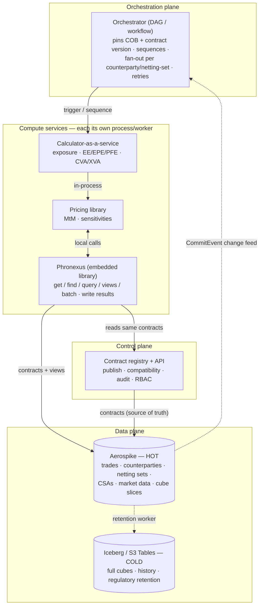

# CCR Reference Architecture — Phronexus as the hot-tier data plane

> How a Counterparty-Credit-Risk platform is layered around Phronexus: what each
> part owns, how compute services reach the hot tier, and the disciplines that
> keep a *shared* hot tier from becoming a distributed mess. Companion to
> [ccr-reference.md](ccr-reference.md) (the worked saga) and
> [product-positioning.md](product-positioning.md) (the scope philosophy).

## Thesis

CCR is two systems: a **quant engine** (pricing, exposure simulation, netting,
collateral, XVA, PFE, SA-CCR) and a **data + orchestration platform**. Phronexus
is the second, never the first. It plays two roles:

- **Data plane (a library):** every compute service embeds Phronexus in-process to
  read the hot tier and write results back — through *contracts and views*, not raw
  Aerospike. The store lives next to the maths, so market/reference data is a local
  call, not a network hop in the inner loop.
- **Control plane (a service):** contracts, policy, audit, and the change feed are
  owned centrally, so every embedded instance sees the *same* governed shapes.

Orchestration (the run graph) sits **on top** — ideally a real DAG/workflow engine,
with Phronexus providing the primitives it coordinates.

## Boundary diagram

## Who owns what

| Concern | Owner | Notes |
|---|---|---|
| Pricing, exposure simulation, netting, collateral, XVA, PFE, SA-CCR/IMM | **Quant engine** (calculator + pricing lib) | the maths; Phronexus never computes these |
| Trades / counterparties / netting sets / CSAs / market data / cube slices — *store, index, serve, version* | **Phronexus (data plane)** | contracts define shape; views define per-consumer exposure |
| Contract governance — schema, compatibility, evolution, audit, RBAC | **Phronexus control plane** (registry + API) | one source of truth; embedded libs are clients of it |
| Run lifecycle — COB snapshot, sequencing, fan-out/in, retries, exactly-once | **Orchestrator** | uses Phronexus primitives (scheduler, saga, change feed) but coordinates *services* |
| Full-cube history, regulatory retention, downstream analytics | **Iceberg / S3 Tables (cold)** | Phronexus is a well-behaved producer via the retention worker |
| Capital calc & regulatory reporting (SA-CCR add-ons, Basel templates) | **Downstream** | out of scope for Phronexus |

## Data-access patterns (make these the house style)

- **Reads through views / read-optimised projections.** Each service reads the shape
  it needs (`bins` projection for native fields; a `view` for allow-list/mask). No
  service reads another's private shape.
- **Load once per run, not per valuation.** Bulk-load market/reference data with
  `get_many` / `find` / a view into the service's memory; never call the store inside
  the pricing inner loop.
- **Writes are single-writer and append-only.** One entity → one writing service.
  Prefer **insert-only versioned** results (append a new version, don't mutate) so
  concurrent services never contend and every run is reconstructable — see
  [`examples/versioned_trade/`](../examples/versioned_trade).
- **Trigger, don't poll.** Downstream steps fire off the `CommitEvent` change feed,
  not by scanning.

## The five disciplines (hold these in review)

1. **Single-writer ownership per entity/set.** Design contention out; rely on manifest
   CAS only where you truly can't.
2. **Pin contract version + COB per run.** Each embedded cache refreshes on its own
   timer — the orchestrator must resolve everyone onto one version for a consistent run.
3. **Load-once hot loops.** Batch/bulk into memory; the store is not in the inner loop.
4. **Connection/capacity sizing.** One `Phronexus` (one Aerospike pool) per worker —
   size `proto-fd-max`/pools for services × workers; keep the per-worker singleton.
5. **Orchestrate in a real engine.** Simple per-entity flow → Phronexus saga/scheduler;
   complex fan-out DAG → DishtaYantra/Temporal, with Phronexus as the data plane.

## Three decisions — now closed (Stage 3)

1. **The engine contract — CLOSED.** The calculator's inputs and results are explicit
   contracts: `value_cube`/`fvcube` (inputs it reads) and the bitemporal
   `exposure_result` (results it writes), advanced by the `ccr_trade` saga
   (`TradeReceived → CubeReady → CalcComplete`, plus `RecalcRequested` intraday). No
   tribal knowledge — it is config.
2. **The netting/aggregation boundary — CLOSED.** Phronexus stores raw per-trade
   `exposure_result` **and serves** a netting-set aggregate (`ns_exposure`). The
   aggregation is a thin, explicit sum over the `idx_ns` membership index
   (`examples/ccr/ccr_ops.py::aggregate_netting_set`); the real netting/XVA maths stays
   in the engine. The boundary is a contract, not a leak.
3. **Cube scale & tiering — CLOSED.** Aggregates and current state are hot (Aerospike);
   full history moves cold to Iceberg via retention (`ccr_trade`, `value_cube`,
   `exposure_result`, `ns_exposure` are all `iceberg.enabled`, each with its own
   `retention_days` horizon). The point cube (`value_cube`) and the transposed cube
   (`fvcube`, dates-as-bins) coexist for fast per-tenor and per-date reads.

Everything above is proven end to end by `examples/ccr/run_ccr.py` and the ten CCR
proofs in `tests/test_ccr_*.py` (`pytest -m ccr`).

## Bottom line

This layering — **Phronexus as the shared, contract-governed hot-tier library for a
fleet of compute services, with orchestration on top and engines to the side** — is
the right fit and is what makes a shared hot tier *safe* to build many services on.
The risk isn't the shape; it's letting the five disciplines slip. Prove it end-to-end
on **one counterparty portfolio** (real engine, real netting boundary, real tiering)
before scaling out.
