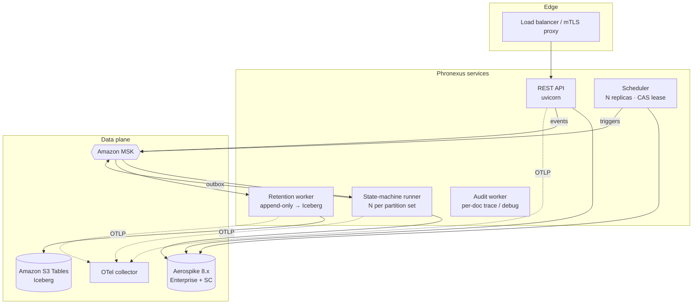
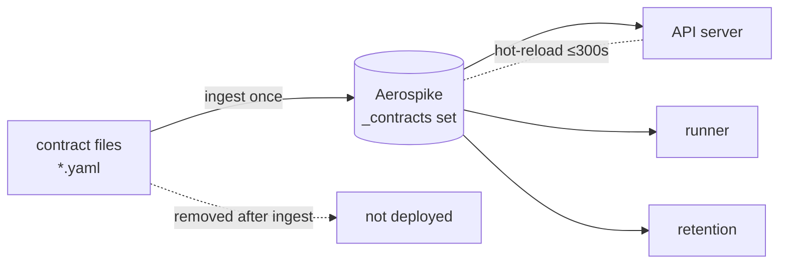

# Production Deployment

How to run Phronexus against real infrastructure — Aerospike, Kafka/MSK, and
Iceberg/S3 Tables — with TLS/mTLS, authentication, observability, and the
operational workers.

## Topology



**Processes** (scale independently):

| Process | Command | Scale by |
|---|---|---|
| REST API | `python -m phronexus.api.server` | replicas behind the LB |
| State-machine runner | `python -m phronexus.statemachine.runner` | Kafka partitions (key = doc_id) |
| Scheduler | `python -m phronexus.scheduler.runner` | replicas (CAS lease → exactly-once) |
| Outbox relay (optional) | `python -m phronexus.statemachine.relay` | replicas (set `statemachine.inline_relay: false`) |
| Change-feed relay (optional) | `python -m phronexus.changefeed_relay` | replicas (set `changefeed.inline_relay: false`) |
| Retention worker | `python -m phronexus.retention.main` | consumer group members |
| Retention compaction | `python -m phronexus.retention.compact` | scheduled job (pairs with the scheduler) |
| Audit / trace worker | `python -m phronexus.audit.main` | consumer group members |
| Reaper / backfill | `phronexus reap …` / `phronexus backfill …` | cron / one-shot jobs |

## Contracts: Aerospike is the source of truth

Contracts live in the Aerospike `_contracts` set — **that is the source of
truth**, not the YAML files. Files are only an *ingestion vehicle*.



- **Ingest once** (a CI/admin step), then the files can be deleted and are **not
  part of the deployment**:

  ```bash
  phronexus ingest ./contracts          # publish a directory into Aerospike
  phronexus list-contracts              # verify what's persisted (source of truth)
  phronexus get-contract storage:trade:v1
  # or over REST (admin):  POST /contracts   GET /contracts   GET /contracts/{identity}
  ```

- **Runtime reads only from Aerospike.** The API server, state-machine runner,
  and workers construct a registry that reads the `_contracts` set and
  hot-reloads on `contracts.refresh_seconds` (default 300s). No file dependency
  at runtime — a new process sees the contracts immediately.
- **Schema evolution** = publish a new version + flip the active pointer (a live
  Aerospike write); running processes pick it up on their next refresh.
- Ingestion is idempotent, so re-running it in CI is safe.

> The in-memory dev/test path calls `load_contract_dir(...)` at startup only
> because that backend is ephemeral. On Aerospike you ingest once and the store
> persists.

## Configuration

Layered, highest precedence first: **kwargs → env vars → `.env` → per-subsystem
YAML files → file secrets**. Keep readable, version-controlled files per
subsystem under `config/` and override with env vars at deploy time.

```bash
export PHRONEXUS_CONFIG_DIR=/etc/phronexus/config
export PHRONEXUS_BACKEND=aerospike
python -m phronexus.api.server
```

**Secrets never live in files** — reference them with `${ENV_VAR}` /
`${ENV_VAR:-default}`, interpolated from the environment at load time. Cert/key
*paths* may live in files; the material is mounted (K8s secret, vault sidecar).

See [`config/README.md`](../config/README.md) and the templates in `config/`.

## Aerospike

Install the driver: `pip install 'phronexus-core[aerospike]'`.

```yaml
# config/aerospike.yaml
hosts: "${AEROSPIKE_HOSTS}"
namespace: phronexus
use_native_txn: true
tls_enable: true
tls_name: phronexus.aerospike
tls_cafile: /etc/phronexus/certs/aerospike-ca.pem
tls_certfile: /etc/phronexus/certs/aerospike-client.pem   # mTLS
tls_keyfile: /etc/phronexus/certs/aerospike-client.key
auth_mode: EXTERNAL
user: "${AEROSPIKE_USER}"
password: "${AEROSPIKE_PASSWORD}"
```

> **Transactions require Enterprise Edition + a strong-consistency (SC)
> namespace.** Native multi-record transactions (Aerospike 8.0+) are the atomic
> core of the manifest write and the state machine. On **Community Edition** set
> `use_native_txn: false`: the manifest pattern still gives all-or-nothing
> *visibility*, but cross-record durability under failure is weaker and the state
> machine degrades from effectively-once toward at-least-once. Choose Enterprise
> + SC for production financial workloads.

### Native client options (passthrough)

Any native client policy Phronexus doesn't surface as a named field can be set
via passthrough — `policies` merges into the client's policy map, `client_config`
merges at the top level (and wins):

```yaml
# config/aerospike.yaml
policies:
  total_timeout: 200          # ms
  max_retries: 3
  read: {replica: 1}          # e.g. PREFER_RACK
client_config:
  rack_id: 7
  use_services_alternate: true
  max_conns_per_node: 300
```

### Using native Aerospike features directly (supported API)

The `KVStore` API is deliberately small. For native capabilities it doesn't wrap
— **expressions/filters, CDT list/map operations, `operate()`, batch ops,
secondary-index queries, UDFs** — use the supported accessor:

```python
nx = px.native_aerospike()          # requires backend='aerospike'

# CDT + expressions on your own set
from aerospike_helpers.operations import list_operations as lo
nx.operate("positions", "acct-1", [lo.list_append("legs", leg)])

# a secondary-index query you manage
nx.create_index("positions", "book", "positions_book_idx")
q = nx.query("positions"); q.where(predicates.equals("book", "IRD-1"))
rows = q.results()

# anything else: the raw connected client
nx.client.batch_read([(ns, "positions", k) for k in keys])
```

`native_aerospike()` returns a facade that injects the namespace and **guards
Phronexus-managed sets**: a *write* to the manifest, projections, inverted index,
outboxes, dedup markers, schedules, or journals raises — those must go through
`px.put()` / the state machine, or you bypass the manifest-last invariant, the
in-transaction index, and the change feed. **Reads and queries are never
guarded, and your own sets have no restrictions.** Call `nx.refresh()` after
publishing new contracts so their sets are recognised. For a fully unguarded
handle, `px.store.native_client()` returns the raw client.

> Phronexus uses its **own inverted index**, not native secondary indexes (a
> deliberate choice). Native sindexes you create are available for your own
> queries, but the framework's query engine won't use them.

## Amazon MSK

Install: `pip install 'phronexus-core[msk]'` (IAM) or `[kafka]` (SCRAM/mTLS).

```yaml
# config/kafka.yaml — IAM auth (recommended)
enabled: true
bootstrap_servers: "${MSK_BOOTSTRAP}"     # IAM listener :9098
msk_iam: true
aws_region: "${AWS_REGION}"
```

MSK IAM uses SASL_SSL + OAUTHBEARER with SigV4 tokens from the instance role.
Alternatives (uncomment in the template): **SASL/SCRAM** (`:9096`, secret in
Secrets Manager) or **mTLS** (`:9094`, client cert from ACM PCA). All wiring goes
through `phronexus.kafka_client`.

## Amazon S3 Tables (Iceberg)

Install: `pip install 'phronexus-core[iceberg]'`.

```yaml
# config/iceberg.yaml
enabled: true
backend: iceberg
catalog_type: rest
catalog_uri: "https://s3tables.${AWS_REGION}.amazonaws.com/iceberg"
warehouse: "arn:aws:s3tables:${AWS_REGION}:${ACCOUNT}:bucket/phronexus"
sigv4_enabled: true
signing_name: s3tables       # or "glue" for the Glue Iceberg REST endpoint
signing_region: "${AWS_REGION}"
```

Credentials come from the AWS default chain (instance role / env / profile). Pin
the `ssl.*` catalog property keys to your `pyiceberg` version — they vary more
across releases than the Kafka/Aerospike ones.

### Validate locally first (MinIO + Iceberg REST)

The exact same code path runs against a **local** Iceberg REST catalog on MinIO,
so you can validate retention before pointing at S3 Tables. The `deploy/` stack
ships an `iceberg` profile (MinIO + `apache/iceberg-rest-fixture` + the retention
worker):

```bash
cd deploy
docker compose --profile iceberg up -d
# write some documents, then:
docker compose --profile iceberg run --rm iceberg-validate
```

The client config differs only in the endpoint and auth — SigV4 off, an explicit
S3 endpoint, static keys:

```yaml
# config/iceberg.yaml (local MinIO)
enabled: true
backend: iceberg
catalog_uri: "http://iceberg-rest:8181"
warehouse: "s3://warehouse/"
s3_endpoint: "http://minio:9000"
s3_region: us-east-1
s3_access_key_id: "${MINIO_KEY}"
s3_secret_access_key: "${MINIO_SECRET}"
```

Moving to S3 Tables is a config swap (catalog URI + `sigv4_enabled: true` +
`signing_name`/`signing_region`), no code change. The retention worker creates
the namespace + table on first use, so no manual DDL is needed in either
environment. See [deploy/README.md](../deploy/README.md#validate-the-iceberg--s3-retention-lake).

## Security

- **Transport**: TLS everywhere; mTLS to Aerospike, MSK, and (optionally) the
  Iceberg catalog. The REST server terminates TLS/mTLS via uvicorn
  (`api.tls_*`, `api.require_client_cert`) or behind a proxy.
- **API authentication** (`api.auth.schemes`, tried in order):
  `none` (dev) · `api_key` (header) · `bearer` (token/JWT) · `mtls` (client-cert
  CN → principal). Contract-admin endpoints additionally require an admin
  principal.
- **Outbound webhooks** (HTTP emit targets) support TLS/mTLS + custom headers
  via `statemachine.http_*`.

```yaml
# config/api.yaml
tls_certfile: /etc/phronexus/certs/api-server.pem
tls_keyfile: /etc/phronexus/certs/api-server.key
tls_ca_certs: /etc/phronexus/certs/api-client-ca.pem
require_client_cert: true
auth:
  schemes: ["mtls", "bearer"]
  mtls_allowed_cns: {risk.svc.internal: svc-risk}
  admin_principals: ["svc-admin"]
```

## Management UI

A self-contained web console ships with the API at **`/ui`** (redirect from `/`).
It's a dependency-free SPA served by FastAPI — no build step, no CDN — so it runs
anywhere the API runs.

Features: browse/edit **contracts** (all six kinds) with **validate-before-save**
(the Save button unlocks only after a successful dry-run against
`POST /contracts/validate`; the server re-validates on publish), a **document
validator** (JSON Schema + DQ), a **state-machine console** (inspect lifecycles,
submit events, see accept/reject), and a **data browser** (read / query).

### Authentication

Login issues a signed **JWT** (HS256, stdlib — no dependency); the UI sends it as
a bearer token and the API enforces it when `api.auth.schemes` includes `jwt`.

```yaml
# config/api.yaml
auth:
  schemes: ["jwt"]                 # enforce the session token
  provider: local                 # local | oidc
  jwt_secret: "${JWT_SECRET}"      # REQUIRED in prod (rotate this)
  jwt_ttl_seconds: 28800
  users:                           # fixed username/password (dev / small teams)
    admin: {password_sha256: "<sha256>", roles: ["admin"]}
    ops:   {password: "changeme",         roles: ["viewer"]}
```

- Store `password_sha256` (not `password`) for anything real, or move to an IdP.
- Roles gate admin actions: publishing/refreshing contracts requires the `admin`
  role (or membership in `admin_principals`).

### Microsoft Entra / Azure AD (SSO)

Full OIDC **authorization-code + PKCE** flow with JWKS id-token verification
(`pip install 'phronexus-core[oidc]'`).

```yaml
# config/api.yaml
auth:
  schemes: ["jwt"]
  provider: oidc
  jwt_secret: "${JWT_SECRET}"
  oidc:
    enabled: true
    issuer: "https://login.microsoftonline.com/<tenant-id>/v2.0"
    client_id: "${ENTRA_CLIENT_ID}"
    client_secret: "${ENTRA_CLIENT_SECRET}"     # omit for a public SPA client (PKCE only)
    redirect_uri: "https://phronexus.example.com/auth/oidc/callback"
    scopes: ["openid", "profile", "email"]
    role_claim: "roles"                          # or "groups"
```

Flow: the UI shows **"Sign in with Microsoft"** → `GET /auth/oidc/login` (builds
the PKCE challenge, carries the verifier in a signed `state`, redirects to Entra)
→ Entra returns to `GET /auth/oidc/callback` → Phronexus exchanges the code,
**verifies the id_token via the tenant JWKS** (signature, `aud`, `iss`, `exp`,
`nonce`), maps `role_claim` → Phronexus roles, mints a session JWT, and hands it
to the SPA in the URL fragment. Password login is disabled under OIDC (browser
flow only).

**Entra app registration:** add the redirect URI above, and expose **app roles**
(e.g. `admin`, `viewer`) so they appear in the `roles` claim. `local` remains the
default provider.

## Observability

```yaml
# config/observability.yaml
service_name: phronexus-core
log_level: INFO
log_json: true
otel_enabled: true
otel_endpoint: http://otel-collector:4317
```

- **Structured logs** (`structlog`, JSON) with a per-request `request_id` bound
  across the API; configurable centrally.
- **OpenTelemetry** traces (span per projection write, manifest commit,
  transition) and metrics over OTLP — writes/reads/queries, latency histograms,
  commit-failure rate, `sm.applied/rejected/duplicate/dropped`, validation
  warnings, contract-cache age, outbox depth. FastAPI is auto-instrumented.
- **Per-Aerospike-operation metrics** (for Dynatrace / CloudWatch via the OTel
  collector), emitted by the KV backend:
  - `phronexus.aerospike.op.duration` — latency histogram (ms)
  - `phronexus.aerospike.op.count` — request counter
  - both tagged `op` (`get` · `put` · `remove` · `batch_get` · `scan` ·
    `txn_commit` · `txn_abort`) and `outcome` (`ok` · `error` · `conflict`;
    errors also carry an `error` type). So success rate, failure rate, CAS-conflict
    rate, and p50/p95/p99 latency are all sliceable per operation.

  Enable by turning on OTel (`otel_enabled: true`, install `phronexus-core[otel]`);
  workers (`retention`, `audit`) export them too via their own settings.

## Operations

| Task | How | When |
|---|---|---|
| **Backfill** a contract change | `phronexus backfill <entity>` | after publishing a new storage/query version |
| **Reap** orphan projections | `phronexus reap <entity> …` | periodic (crash cleanup) |
| **Retention** to Iceberg | `python -m phronexus.retention.main` | always-on worker |
| **Audit / trace** trail | `python -m phronexus.audit.main` | always-on worker (powers the Trace view) |
| **Publish** a contract | `POST /contracts` or `phronexus publish-contract` | schema evolution |

Backfill is idempotent (writes are keyed by `doc_id` + generation CAS), so it's
safe to re-run.

**Outbox relay.** Set `statemachine.inline_relay: false` and run
`python -m phronexus.statemachine.relay` to decouple output publishing from the
write path — so a slow broker/webhook never adds latency to the sync `/events`
endpoint or the runner. The transition is durable on commit; the relay publishes
at-least-once and scales with replicas.

## Durability & failure handling

- **Change-feed is transactional.** Every committed document's change-feed event
  is staged into the *same* write transaction (`_cf_outbox`) and relayed to
  Kafka — so retention can never miss a committed document on a crash. Inline by
  default; set `changefeed.inline_relay: false` + run the change-feed relay to
  decouple it from the write path.
- **Dead-letter queue.** Set `statemachine.dlq_topic` (e.g. `kafka://phronexus.dlq`)
  and the runner routes rejected/poison events there with their reason instead of
  dropping them. `applied`/`duplicate` don't dead-letter; `dropped` (a hook chose
  to skip) doesn't either.
- **Write retries.** Writes retry on optimistic-concurrency conflicts
  (`aerospike.write_max_retries`, default 3) — covers competing writers and
  hot-term index contention.
- **Graceful shutdown.** The runner and relays handle SIGTERM/SIGINT: they stop
  the loop, drain pending outputs, and close the consumer (committing Kafka
  offsets) before exiting.
- **Readiness** (`/readyz`) verifies actual backend connectivity (a store read),
  not just process liveness — returns `503` if the store is unreachable.

## Scaling & ordering

- **Partition by `doc_id`** (Kafka message key) so all events for an entity are
  ordered on a single consumer — no concurrent transitions on a key; the manifest
  generation-CAS is the backstop.
- Scale the API by replicas, the runner by partitions, retention by consumer
  group members. Each process holds its **own** Aerospike/Kafka connections and
  contract cache (per-process, not shared) — safe under multiprocessing.

## Health & readiness

`GET /healthz` (liveness) and `GET /readyz` (ready once the contract cache has
loaded; reports backend and cache age) — wire them to your orchestrator probes.

## Pre-production checklist

- [ ] Aerospike **Enterprise + SC namespace** (or `use_native_txn: false` accepted)
- [ ] TLS/mTLS certs mounted; `require_client_cert` set as needed
- [ ] Secrets supplied via env (`${…}`), not committed
- [ ] MSK auth verified (IAM token round-trip / SCRAM / mTLS)
- [ ] S3 Tables SigV4 + catalog property keys pinned to your `pyiceberg` version
- [ ] Retention worker + reaper scheduled; runner partitioned by `doc_id`
- [ ] OTel collector reachable; dashboards/alerts on commit-failure & outbox depth
- [ ] Load test at expected event rate (`python scripts/loadtest.py`)
