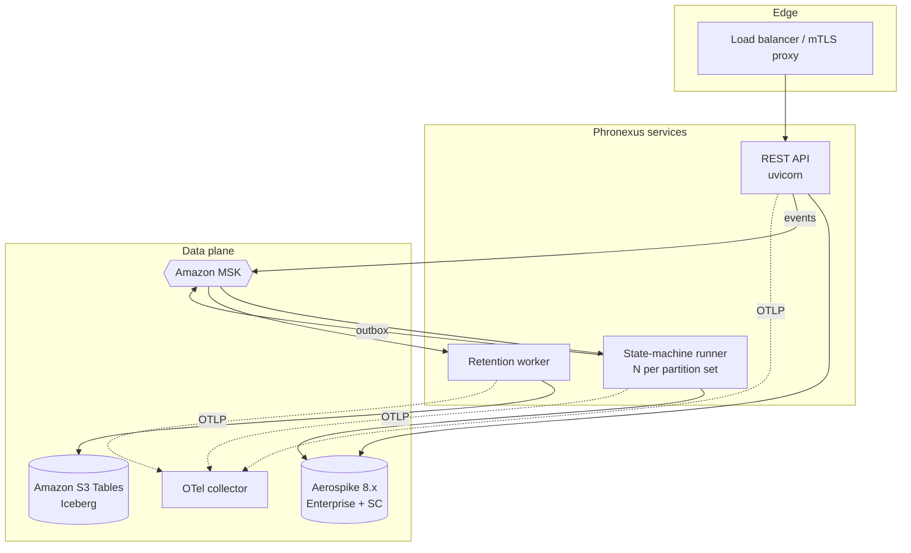

# Production Deployment

How to run Phronexus against real infrastructure — Aerospike, Kafka/MSK, and
Iceberg/S3 Tables — with TLS/mTLS, authentication, observability, and the
operational workers.

## Topology



**Processes** (scale independently):

| Process | Command | Scale by |
|---|---|---|
| REST API | `python -m phronexus.api.server` | replicas behind the LB |
| State-machine runner | `python -m phronexus.statemachine.runner` | Kafka partitions (key = doc_id) |
| Retention worker | `python -m phronexus.retention.main` | consumer group members |
| Reaper / backfill | `phronexus reap …` / `phronexus backfill …` | cron / one-shot jobs |

## Configuration

Layered, highest precedence first: **kwargs → env vars → `.env` → per-subsystem
YAML files → file secrets**. Keep readable, version-controlled files per
subsystem under `config/` and override with env vars at deploy time.

```bash
export PHRONEXUS_CONFIG_DIR=/etc/phronexus/config
export PHRONEXUS_BACKEND=aerospike
python -m phronexus.api.server
```

**Secrets never live in files** — reference them with `${ENV_VAR}` /
`${ENV_VAR:-default}`, interpolated from the environment at load time. Cert/key
*paths* may live in files; the material is mounted (K8s secret, vault sidecar).

See [`config/README.md`](../config/README.md) and the templates in `config/`.

## Aerospike

Install the driver: `pip install 'phronexus-core[aerospike]'`.

```yaml
# config/aerospike.yaml
hosts: "${AEROSPIKE_HOSTS}"
namespace: phronexus
use_native_txn: true
tls_enable: true
tls_name: phronexus.aerospike
tls_cafile: /etc/phronexus/certs/aerospike-ca.pem
tls_certfile: /etc/phronexus/certs/aerospike-client.pem   # mTLS
tls_keyfile: /etc/phronexus/certs/aerospike-client.key
auth_mode: EXTERNAL
user: "${AEROSPIKE_USER}"
password: "${AEROSPIKE_PASSWORD}"
```

> **Transactions require Enterprise Edition + a strong-consistency (SC)
> namespace.** Native multi-record transactions (Aerospike 8.0+) are the atomic
> core of the manifest write and the state machine. On **Community Edition** set
> `use_native_txn: false`: the manifest pattern still gives all-or-nothing
> *visibility*, but cross-record durability under failure is weaker and the state
> machine degrades from effectively-once toward at-least-once. Choose Enterprise
> + SC for production financial workloads.

## Amazon MSK

Install: `pip install 'phronexus-core[msk]'` (IAM) or `[kafka]` (SCRAM/mTLS).

```yaml
# config/kafka.yaml — IAM auth (recommended)
enabled: true
bootstrap_servers: "${MSK_BOOTSTRAP}"     # IAM listener :9098
msk_iam: true
aws_region: "${AWS_REGION}"
```

MSK IAM uses SASL_SSL + OAUTHBEARER with SigV4 tokens from the instance role.
Alternatives (uncomment in the template): **SASL/SCRAM** (`:9096`, secret in
Secrets Manager) or **mTLS** (`:9094`, client cert from ACM PCA). All wiring goes
through `phronexus.kafka_client`.

## Amazon S3 Tables (Iceberg)

Install: `pip install 'phronexus-core[iceberg]'`.

```yaml
# config/iceberg.yaml
enabled: true
backend: iceberg
catalog_type: rest
catalog_uri: "https://s3tables.${AWS_REGION}.amazonaws.com/iceberg"
warehouse: "arn:aws:s3tables:${AWS_REGION}:${ACCOUNT}:bucket/phronexus"
sigv4_enabled: true
signing_name: s3tables       # or "glue" for the Glue Iceberg REST endpoint
signing_region: "${AWS_REGION}"
```

Credentials come from the AWS default chain (instance role / env / profile). Pin
the `ssl.*` catalog property keys to your `pyiceberg` version — they vary more
across releases than the Kafka/Aerospike ones.

## Security

- **Transport**: TLS everywhere; mTLS to Aerospike, MSK, and (optionally) the
  Iceberg catalog. The REST server terminates TLS/mTLS via uvicorn
  (`api.tls_*`, `api.require_client_cert`) or behind a proxy.
- **API authentication** (`api.auth.schemes`, tried in order):
  `none` (dev) · `api_key` (header) · `bearer` (token/JWT) · `mtls` (client-cert
  CN → principal). Contract-admin endpoints additionally require an admin
  principal.
- **Outbound webhooks** (HTTP emit targets) support TLS/mTLS + custom headers
  via `statemachine.http_*`.

```yaml
# config/api.yaml
tls_certfile: /etc/phronexus/certs/api-server.pem
tls_keyfile: /etc/phronexus/certs/api-server.key
tls_ca_certs: /etc/phronexus/certs/api-client-ca.pem
require_client_cert: true
auth:
  schemes: ["mtls", "bearer"]
  mtls_allowed_cns: {risk.svc.internal: svc-risk}
  admin_principals: ["svc-admin"]
```

## Observability

```yaml
# config/observability.yaml
service_name: phronexus-core
log_level: INFO
log_json: true
otel_enabled: true
otel_endpoint: http://otel-collector:4317
```

- **Structured logs** (`structlog`, JSON) with a per-request `request_id` bound
  across the API; configurable centrally.
- **OpenTelemetry** traces (span per projection write, manifest commit,
  transition) and metrics over OTLP — writes/reads/queries, latency histograms,
  commit-failure rate, `sm.applied/rejected/duplicate/dropped`, validation
  warnings, contract-cache age, outbox depth. FastAPI is auto-instrumented.

## Operations

| Task | How | When |
|---|---|---|
| **Backfill** a contract change | `phronexus backfill <entity>` | after publishing a new storage/query version |
| **Reap** orphan projections | `phronexus reap <entity> …` | periodic (crash cleanup) |
| **Retention** to Iceberg | `python -m phronexus.retention.main` | always-on worker |
| **Publish** a contract | `POST /contracts` or `phronexus publish-contract` | schema evolution |

Backfill is idempotent (writes are keyed by `doc_id` + generation CAS), so it's
safe to re-run.

## Scaling & ordering

- **Partition by `doc_id`** (Kafka message key) so all events for an entity are
  ordered on a single consumer — no concurrent transitions on a key; the manifest
  generation-CAS is the backstop.
- Scale the API by replicas, the runner by partitions, retention by consumer
  group members. Each process holds its **own** Aerospike/Kafka connections and
  contract cache (per-process, not shared) — safe under multiprocessing.

## Health & readiness

`GET /healthz` (liveness) and `GET /readyz` (ready once the contract cache has
loaded; reports backend and cache age) — wire them to your orchestrator probes.

## Pre-production checklist

- [ ] Aerospike **Enterprise + SC namespace** (or `use_native_txn: false` accepted)
- [ ] TLS/mTLS certs mounted; `require_client_cert` set as needed
- [ ] Secrets supplied via env (`${…}`), not committed
- [ ] MSK auth verified (IAM token round-trip / SCRAM / mTLS)
- [ ] S3 Tables SigV4 + catalog property keys pinned to your `pyiceberg` version
- [ ] Retention worker + reaper scheduled; runner partitioned by `doc_id`
- [ ] OTel collector reachable; dashboards/alerts on commit-failure & outbox depth
- [ ] Load test at expected event rate (`python scripts/loadtest.py`)
